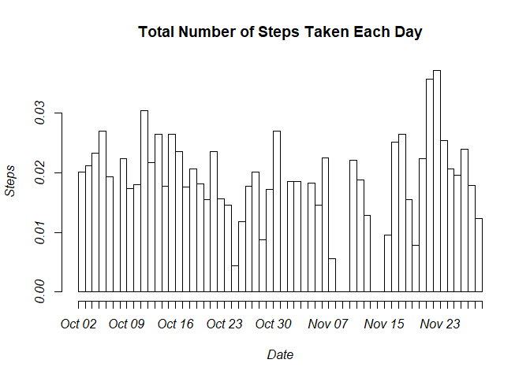
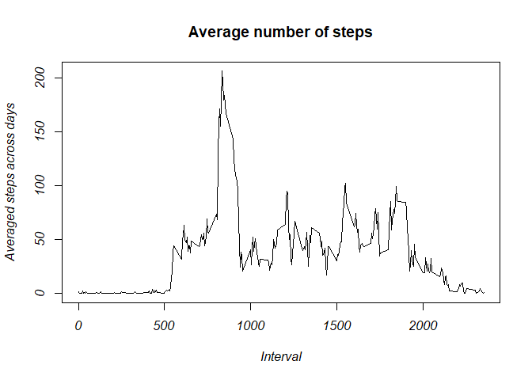
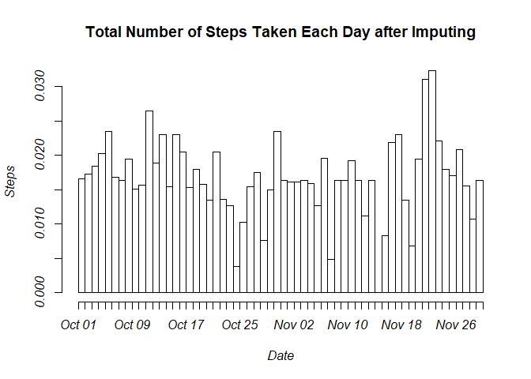
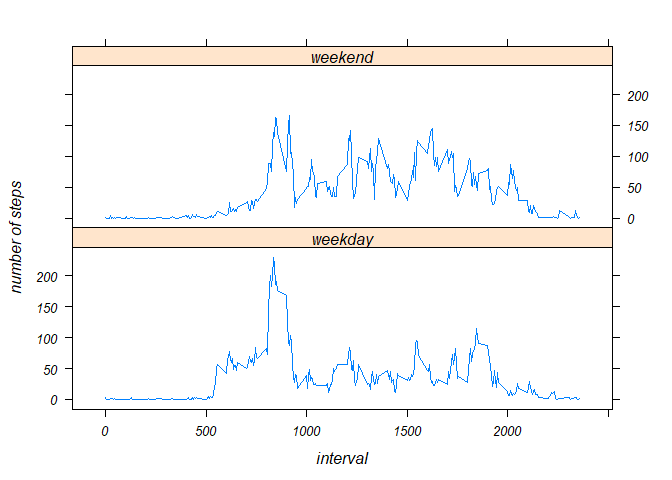

## Loading and preprocessing the data

```r
activity <- read.csv("activity.csv")
activity$date<-as.Date(activity$date)
```

## What is mean total number of steps taken per day?

```r
library (dplyr)
```

```
## 
## Attaching package: 'dplyr'
```

```
## The following objects are masked from 'package:stats':
## 
##     filter, lag
```

```
## The following objects are masked from 'package:base':
## 
##     intersect, setdiff, setequal, union
```

```r
library(lubridate)
```

```
## 
## Attaching package: 'lubridate'
```

```
## The following objects are masked from 'package:dplyr':
## 
##     intersect, setdiff, union
```

```
## The following objects are masked from 'package:base':
## 
##     date, intersect, setdiff, union
```

```r
library(lattice)
```
Total number of steps per day

```r
step_sum<-activity %>% group_by (date) %>% summarize (step_sum = sum(steps,na.rm = TRUE))
step_sum
```

```
## # A tibble: 61 x 2
##    date       step_sum
##    <date>        <int>
##  1 2012-10-01        0
##  2 2012-10-02      126
##  3 2012-10-03    11352
##  4 2012-10-04    12116
##  5 2012-10-05    13294
##  6 2012-10-06    15420
##  7 2012-10-07    11015
##  8 2012-10-08        0
##  9 2012-10-09    12811
## 10 2012-10-10     9900
## # ... with 51 more rows
```

```r
hist(rep(ymd(step_sum$date),step_sum$step_sum),breaks ="days",main="Total Number of Steps Taken Each Day",xlab="Date",ylab="Steps")
```

<!-- -->

```r
activity %>% group_by (date) %>% summarize (step_mean = mean(steps,na.rm = TRUE), step_median=median(steps,na.rm = TRUE))
```

```
## # A tibble: 61 x 3
##    date       step_mean step_median
##    <date>         <dbl>       <dbl>
##  1 2012-10-01   NaN              NA
##  2 2012-10-02     0.438           0
##  3 2012-10-03    39.4             0
##  4 2012-10-04    42.1             0
##  5 2012-10-05    46.2             0
##  6 2012-10-06    53.5             0
##  7 2012-10-07    38.2             0
##  8 2012-10-08   NaN              NA
##  9 2012-10-09    44.5             0
## 10 2012-10-10    34.4             0
## # ... with 51 more rows
```

## What is the average daily activity pattern?

```r
average_step<-activity %>% group_by(interval) %>%
summarize(average_steps=mean(steps,na.rm = TRUE))

plot (average_step$interval, average_step$average_steps,type='l',main='Average number of steps', xlab = 'Interval', ylab = 'Averaged steps across days')
```

<!-- -->

```r
#Which 5-minute interval, on average across all the days in the dataset, contains the maximum number of steps?
average_step$interval[average_step$average_steps==max(average_step$average_steps)]
```

```
## [1] 835
```

## Imputing missing values
Calculate total number of missing values

```r
sum(is.na(activity$steps))
```

```
## [1] 2304
```
Filling in missing values

```r
# create a new data set (activity1) that is equal to the original dataset but with the missing data filled based on the mean for that 5-minute interval
activity1<-activity
for (i in activity[is.na(activity$steps),][,3]) {
  activity1[is.na(activity$steps) & activity$interval==i,1]<-average_step[average_step$interval==i,2]
}

step_sum1<-activity1 %>% group_by (date) %>% summarize (step_sum = sum(steps))
hist(rep(ymd(step_sum1$date),step_sum1$step_sum),breaks ="days",main="Total Number of Steps Taken Each Day after Imputing",xlab="Date",ylab="Steps")
```

<!-- -->

```r
# summary of mean and median total number of steps taken per day after imputing
activity1 %>% group_by (date) %>% summarize (step_mean = mean(steps), step_median=median(steps))
```

```
## # A tibble: 61 x 3
##    date       step_mean step_median
##    <date>         <dbl>       <dbl>
##  1 2012-10-01    37.4          34.1
##  2 2012-10-02     0.438         0  
##  3 2012-10-03    39.4           0  
##  4 2012-10-04    42.1           0  
##  5 2012-10-05    46.2           0  
##  6 2012-10-06    53.5           0  
##  7 2012-10-07    38.2           0  
##  8 2012-10-08    37.4          34.1
##  9 2012-10-09    44.5           0  
## 10 2012-10-10    34.4           0  
## # ... with 51 more rows
```
According to the new summarization table, the mean and median total number of steps taken per day after imputing missing data have different values on days with missing values. After imputing missing data, no missing bars observed in the histogram anymore. 

## Are there differences in activity patterns between weekdays and weekends?

```r
#create a new varible(weekdays) in activity1 with two levels – “weekday” and “weekend” 
activity1$weekdays<-weekdays(ymd(activity1$date))
activity1[activity1$weekdays %in% c("Monday","Tuesday","Wednesday","Thursday","Friday"),4]<-"weekday"
activity1[activity1$weekdays %in% c("Saturday","Sunday"),4]<-"weekend"
#panel plot
average_step1<-activity1 %>% group_by(interval,weekdays) %>%
summarize(average_steps=mean(steps))
xyplot(average_step1$average_steps~average_step1$interval|average_step1$weekdays,type='l',layout=c(1,2),ylab="number of steps", xlab="interval")
```

<!-- -->
According to the panel plot, activity patterns are different between weekdays and weekends
